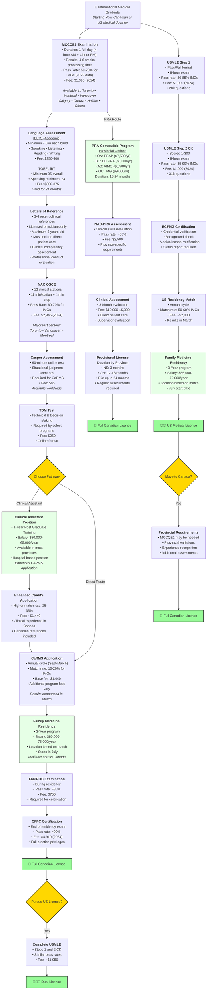

```mermaid
flowchart TD
    Start["🔄 International Medical Graduate<br/><i>Starting Your Canadian or US Medical Journey</i>"]

    %% Canadian Main Path
    Start -->MCCQE1["<b>MCCQE1 Examination</b><br/>• Duration: 1 full day (4 hour AM + 4 hour PM)<br/>• Results: 4-6 weeks processing time<br/>• Pass Rate: 50-70% for IMGs (2023 data)<br/>• Fee: $1,395 (2024)<br/><br/><i>Available in: Toronto • Montreal • Vancouver<br/>Calgary • Ottawa • Halifax • Others</i>"]
    MCCQE1 -->LANG["<b>Language Assessment</b><br/><u>IELTS (Academic)</u><br/>• Minimum 7.0 in each band<br/>• Speaking • Listening • Reading • Writing<br/>• Fee: $350-400<br/><br/><u>TOEFL iBT</u><br/>• Minimum 95 overall<br/>• Speaking minimum: 24<br/>• Fee: $300-375<br/><i>Valid for 24 months</i>"]
    LANG -->LOR["<b>Letters of Reference</b><br/>• 3-4 recent clinical references<br/>• Licensed physicians only<br/>• Maximum 2 years old<br/>• Must include direct patient care<br/>• Clinical competency assessment<br/>• Professional conduct evaluation"]
    LOR -->NACOSCE["<b>NAC OSCE</b><br/>• 12 clinical stations<br/>• 11 min/station + 4 min prep<br/>• Pass Rate: 60-70% for IMGs<br/>• Fee: $2,945 (2024)<br/><br/><i>Major test centers:<br/>Toronto • Vancouver • Montreal</i>"]
    NACOSCE -->CASPER["<b>Casper Assessment</b><br/>• 90-minute online test<br/>• Situational judgment scenarios<br/>• Required for CaRMS<br/>• Fee: $85<br/><i>Available worldwide</i>"]
    CASPER -->TDM["<b>TDM Test</b><br/>• Technical & Decision Making<br/>• Required by select programs<br/>• Fee: $250<br/>• Online format"]
    TDM -->PathChoice{Choose Pathway}

    %% Clinical Assistant Route
    PathChoice -->|Clinical Assistant| CA["<b>Clinical Assistant Position</b><br/>• 1-Year Post Graduate Training<br/>• Salary: $50,000-65,000/year<br/>• Available in most provinces<br/>• Hospital-based position<br/><i>Enhances CaRMS application</i>"]
    CA -->CaRMSEnhanced["<b>Enhanced CaRMS Application</b><br/>• Higher match rate: 25-35%<br/>• Fee: ~$1,440<br/>• Clinical experience in Canada<br/>• Canadian references included"]
    CaRMSEnhanced -->CaRMS

    %% Direct CaRMS Route
    PathChoice -->|Direct Route| CaRMS["<b>CaRMS Application</b><br/>• Annual cycle (Sept-March)<br/>• Match rate: 10-20% for IMGs<br/>• Base fee: $1,440<br/>• Additional program fees vary<br/><i>Results announced in March</i>"]
    CaRMS -->FMRes["<b>Family Medicine Residency</b><br/>• 2-Year program<br/>• Salary: $60,000-75,000/year<br/>• Location based on match<br/>• Starts in July<br/><i>Available across Canada</i>"]
    FMRes -->FMPROC["<b>FMPROC Examination</b><br/>• During residency<br/>• Pass rate: ~85%<br/>• Fee: $750<br/>• Required for certification"]
    FMPROC -->CFPC["<b>CFPC Certification</b><br/>• End of residency exam<br/>• Pass rate: >90%<br/>• Fee: $4,910 (2024)<br/>• Full practice privileges"]
    CFPC -->CanLicense["🍁 Full Canadian License"]

    %% PRA Route
    MCCQE1 -->|PRA Route| PRA["<b>PRA-Compatible Program</b><br/><u>Provincial Options</u><br/>• ON: PEAP ($7,500/yr)<br/>• BC: BC PRA ($8,000/yr)<br/>• AB: AIMG ($6,500/yr)<br/>• QC: IMG ($9,000/yr)<br/>Duration: 18-24 months"]
    PRA -->NACPRA["<b>NAC-PRA Assessment</b><br/>• Clinical skills evaluation<br/>• Pass rate: ~65%<br/>• Fee: $2,500<br/>• Province-specific requirements"]
    NACPRA -->Clinical["<b>Clinical Assessment</b><br/>• 3-Month evaluation<br/>• Fee: $10,000-15,000<br/>• Direct patient care<br/>• Supervisor evaluation"]
    Clinical -->ProvLicense["<b>Provisional License</b><br/><u>Duration by Province</u><br/>• NS: 3 months<br/>• ON: 12-18 months<br/>• BC: up to 24 months<br/>• Regular assessments required"]
    ProvLicense -->CanLicense2["🍁 Full Canadian License"]

    %% US Route
    Start -->USMLE1["<b>USMLE Step 1</b><br/>• Pass/Fail format<br/>• 8-hour exam<br/>• Pass rate: 80-85% IMGs<br/>• Fee: $1,000 (2024)<br/>• 280 questions"]
    USMLE1 -->USMLE2["<b>USMLE Step 2 CK</b><br/>• Scored 1-300<br/>• 9-hour exam<br/>• Pass rate: 85-90% IMGs<br/>• Fee: $1,000 (2024)<br/>• 318 questions"]
    USMLE2 -->ECFMG["<b>ECFMG Certification</b><br/>• Credential verification<br/>• Background check<br/>• Medical school verification<br/>• Status report required"]
    ECFMG -->USMatch["<b>US Residency Match</b><br/>• Annual cycle<br/>• Match rate: 50-60% IMGs<br/>• Fee: ~$2,000<br/>• Results in March"]
    USMatch -->USRes["<b>Family Medicine Residency</b><br/>• 3-Year program<br/>• Salary: $55,000-70,000/year<br/>• Location based on match<br/>• July start date"]
    USRes -->USLicense["🇺🇸 US Medical License"]

    %% Cross-Border Options
    CanLicense -->CrossUS{"Pursue US License?"}
    CrossUS -->|Yes| CrossUSMLE["<b>Complete USMLE</b><br/>• Steps 1 and 2 CK<br/>• Similar pass rates<br/>• Fee: ~$1,950"]
    CrossUSMLE -->DualLicense["🍁🇺🇸 Dual License"]

    USLicense -->CrossCan{"Move to Canada?"}
    CrossCan -->|Yes| CrossProv["<b>Provincial Requirements</b><br/>• MCCQE1 may be needed<br/>• Provincial variations<br/>• Experience recognition<br/>• Additional assessments"]
    CrossProv -->CanLicense3["🍁 Full Canadian License"]

    %% Styling
    classDef decision fill:#ffd700,stroke:#333,stroke-width:2px
    classDef endpoint fill:#98fb98,stroke:#333,stroke-width:2px
    classDef paid fill:#e6ffe6,stroke:#333
    
    class PathChoice,CrossUS,CrossCan decision
    class CanLicense,CanLicense2,CanLicense3,USLicense,DualLicense endpoint
    class CA,FMRes,PRA,USRes paid
```
