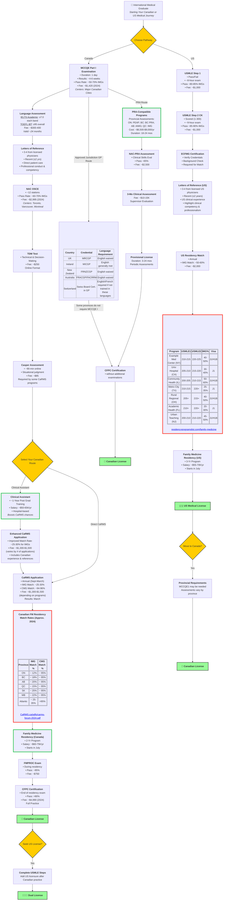

```mermaid
flowchart TD
    Start["🔄 International Medical Graduate<br/><i>Starting Your Canadian or US Medical Journey</i>"]

    %% Decision: Canada or US
    Start --> PathChoice{Choose Pathway}

    classDef decision fill:#FFCC00,stroke:#333,stroke-width:2px
    classDef endpoint fill:#98fb98,stroke:#333,stroke-width:2px
    classDef warn stroke:#FF3B30,stroke-width:4px
    classDef paid stroke:#34C759,stroke-width:4px

    class PathChoice decision

    %% Canadian Main Path
    PathChoice -->|Canada| MCCQE1["<b>MCCQE Part I Examination</b><br/>• Duration: 1 day<br/>• Results: ~4-6 weeks<br/>• Pass Rate: ~50-70% IMGs<br/>• Fee: ~$1,420 (2024)<br/><i>Centers: Major Canadian Cities</i>"]
    MCCQE1 --> LANG["<b>Language Assessment</b><br/><u>IELTS Academic</u>: ≥7.0 each band<br/><u>TOEFL iBT</u>: ≥95 overall<br/>Fee: ~$300-400<br/><i>Valid ~24 months</i>"]
    LANG --> LOR["<b>Letters of Reference</b><br/>• 3-4 from licensed physicians<br/>• Recent (≤2 yrs)<br/>• Direct patient care<br/>• Professional conduct & competency"]
    LOR --> NACOSCE["<b>NAC OSCE</b><br/>• ~12 stations<br/>• Pass Rate: ~60-70% IMGs<br/>• Fee: ~$2,995 (2024)<br/><i>Centers: Toronto, Vancouver, Montreal</i>"]
    NACOSCE -->  TDM["<b>TDM Test</b><br/>• Technical & Decision-Making<br/>• Fee: ~$250<br/>Online Format"]
    TDM -->  CASPER["<b>Casper Assessment</b><br/>• ~90-min online<br/>• Situational judgment<br/>• Fee: ~$85<br/>Required by some CaRMS programs"]
    CASPER --> CanadaRoute{Select Your Canadian Route}

    class CanadaRoute decision

    %% Clinical Assistant Route
    CanadaRoute -->|Clinical Assistant| CA["<b>Clinical Assistant</b><br/>• ~1-Year Post Grad Training<br/>• Salary: ~$50-65K/yr<br/>• Hospital-based<br/><i>Boosts CaRMS chances</i>"]
    CA --> CaRMSEnhanced["<b>Enhanced CaRMS Application</b><br/>• Improved Match Rate: ~25-30% for IMGs<br/>• Fee: ~$1,300-$1,500 (varies by # of applications)<br/>• Includes Canadian experience & references"]
    CaRMSEnhanced --> CaRMS

    %% Direct CaRMS Route
    CanadaRoute -->|Direct CaRMS| CaRMS["<b>CaRMS Application</b><br/>• Annual (Sept-March)<br/>• IMG Match: ~25-30%<br/>• CMG Match: ~94-96%<br/>• Fee: ~$1,300-$1,500 (depending on programs)<br/>Results: March"]

    %% Provincial Match Rate Table (Canada)
    CaRMS --> ProvData["<b>Canadian FM Residency Match Rates (Approx. 2024)</b><br/>
    <table border=1>
    <tr><th>Province</th><th>IMG Match %</th><th>CMG Match %</th></tr>
    <tr><td>ON</td><td>~ 12%</td><td>~ 95%</td></tr>
    <tr><td>BC</td><td>~ 18%</td><td>~ 95%</td></tr>
    <tr><td>AB</td><td>~ 20%</td><td>~ 95%</td></tr>
    <tr><td>QC</td><td>~ 15%</td><td>~ 95%</td></tr>
    <tr><td>SK</td><td>~ 25%</td><td>~ 95%</td></tr>
    <tr><td>MB</td><td>~ 22%</td><td>~ 95%</td></tr>
    <tr><td>Atlantic</td><td>~ 25-35%</td><td>>95%</td></tr>
    </table>
    <br/><a href='https://www.carms.ca/pdfs/carms-forum-2024.pdf' target='_blank'>CaRMS.ca/pdfs/carms-forum-2024.pdf</a>
    "]
    ProvData --> FMRes["<b>Family Medicine Residency (Canada)</b><br/>• 2-Yr Program<br/>• Salary: ~$60-75K/yr<br/>• Starts in July"]
    FMRes --> FMPROC["<b>FMPROC Exam</b><br/>• During residency<br/>• Pass: ~85%<br/>• Fee: ~$750"]
    FMPROC --> CFPC["<b>CFPC Certification</b><br/>• End of residency exam<br/>• Pass: >90%<br/>• Fee: ~$4,990 (2024)<br/>Full Practice"]
    CFPC --> CanLicense["🍁 <b> Canadian License</b>"]


  MCCQE1 --> |Approved Jurisdiction GP Route| ApprovedGP["
  <table border=1 style='border-collapse:collapse;'>
    <tr><th>Country</th><th>Credential</th><th>Language Requirement</th></tr>
    <tr><td>UK</td><td>MRCGP</td><td>English waived</td></tr>
    <tr><td>Ireland</td><td>MICGP</td><td>English generally met</td></tr>
    <tr><td>New Zealand</td><td>FRNZCGP</td><td>English waived</td></tr>
    <tr><td>Australia</td><td>FRACGP/FACRRM</td><td>English waived</td></tr>
    <tr><td>Switzerland</td><td>Swiss Board Cert. in GP</td><td>English/French required if not trained in these languages</td></tr>
    </table>
  "] 
  ApprovedGP --> |Some provinces do not require MCCQE I| CFPC2

    %% PRA Route (Alternate Canada)
    MCCQE1 -->|PRA Route| PRA["<b>PRA-Compatible Programs</b><br/>Provincial Assessments:<br/>ON: PEAP; BC: BC PRA; AB: AIMG; QC: IMG<br/>Cost: ~$6,500-$9,000/yr<br/>Duration: 18-24 mos"]
    PRA --> NACPRA["<b>NAC-PRA Assessment</b><br/>• Clinical Skills Eval<br/>• Pass ~65%<br/>• Fee: ~$2,500"]
    NACPRA --> Clinical["<b>3-Mo Clinical Assessment</b><br/>Fee: ~$10-15K<br/>Supervisor Evaluation"]
    Clinical --> ProvLicense["<b>Provisional License</b><br/>Duration: 3-24 mos<br/>Periodic Assessments"]
    ProvLicense --> CFPC2["<b>CFPC Certification</b><br/>• without additional examinations"]
    CFPC2 --> CanLicense2["🍁 <b> Canadian License</b>"]

    %% US Main Path
    PathChoice -->|US| USMLE1["<b>USMLE Step 1</b><br/>• Pass/Fail<br/>• ~8-hour exam<br/>• Pass ~80-85% IMGs<br/>• Fee: ~$1,000"]
    USMLE1 --> USMLE2["<b>USMLE Step 2 CK</b><br/>• Scored (1-300)<br/>• ~9-hour exam<br/>• Pass ~85-90% IMGs<br/>• Fee: ~$1,000"]
    USMLE2 --> ECFMG["<b>ECFMG Certification</b><br/>• Verify Credentials<br/>• Background Check<br/>• Required for Match"]

    ECFMG --> LORUS["<b>Letters of Reference (US)</b><br/>• 3-4 from licensed US physicians<br/>• Recent (≤2 years)<br/>• US clinical experience<br/>• Highlight clinical competency & professionalism"]
    LORUS --> USMatch["<b>US Residency Match</b><br/>• Annual<br/>• IMG Match: ~50-60%<br/>• Fee: ~$2,000"]
    USMatch --> USRes["
     <table border=1>
    <tr><th>Program</th><th>USMLE1</th><th>USMLE2</th><th>IMG%</th><th>Visa</th></tr>
    <tr><td>Example Med Center (NY)</td><td>210-215</td><td>220-225</td><td>40-50%</td><td>J1/H1B</td></tr>
    <tr><td>Univ Hospital (CA)</td><td>205-210</td><td>215-220</td><td>30-40%</td><td>J1</td></tr>
    <tr><td>Community Health (IL)</td><td>200-205</td><td>210-215</td><td>50-60%</td><td>J1/H1B</td></tr>
    <tr><td>Metro City (TX)</td><td>210-215</td><td>220+</td><td>25-35%</td><td>J1</td></tr>
    <tr><td>Rural Regional (OH)</td><td>205+</td><td>215+</td><td>40-50%</td><td>J1/H1B</td></tr>
    <tr><td>Academic Health (FL)</td><td>210+</td><td>220+</td><td>20-30%</td><td>J1</td></tr>
    <tr><td>Urban Teaching (NJ)</td><td>200-210</td><td>210-220</td><td>45-50%</td><td>J1/H1B</td></tr>
    </table> 
    <a href='https://www.residencyprogramslist.com/family-medicine' target='_blank'>residencyprogramslist.com/family-medicine</a>
    "]
    USRes --> USData["<b>Family Medicine Residency (US)</b><br/>• 3-Yr Program<br/>• Salary: ~$55-70K/yr<br/>• Starts in July"]

    USData --> USLicense["🇺🇸 <b>US Medical License</b>"]

    %% Cross-Border Options
    CanLicense --> CrossUS{"Seek US License?"}
    class CrossUS decision
    CrossUS -->|Yes| CrossUSMLE["<b>Complete USMLE Steps</b><br/>Add US licensure after Canadian practice"]
    CrossUSMLE --> DualLicense["🍁🇺🇸 <b>Dual License</b>"]

    USLicense --> CrossCan{"Move to Canada?"}
    class CrossCan decision
    CrossCan -->|Yes| CrossProv["<b>Provincial Requirements</b><br/>MCCQE1 may be needed<br/>Assessments vary by province"]
    CrossProv --> CanLicense3["🍁 <b> Canadian License</b>"]


    %% Final class assignments
    class CanLicense,CanLicense2,CanLicense3,CanLicense4,USLicense,DualLicense endpoint
    class USRes,ProvData warn
    class CA,FMRes,PRA paid
```